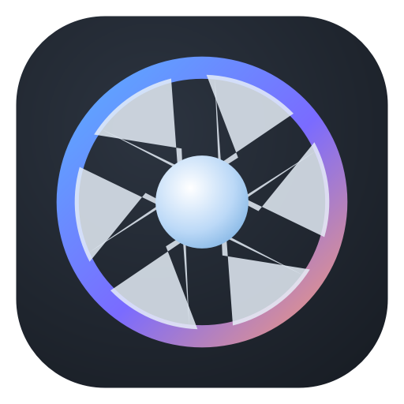

<div align="center">



# Lumina

**A free, open-source RAW photo editor for macOS**

Built with Python · PySide6 · LibRaw · Apple Vision · OpenCV

[](https://www.apple.com/macos)
[](https://www.python.org)
[](LICENSE)

[Features](#features) · [Quick Start](#quick-start) · [Modules](#modules) · [Keyboard Shortcuts](#keyboard-shortcuts) · [Performance](#performance)

</div>

---

## Features

### Develop
Full non-destructive RAW editing with progressive-resolution rendering
(14 ms drag / 54 ms release / 125 ms quality at 2016px).

| Panel | Controls |
|-------|----------|
| **Basic** | Temp · Tint · Exposure · Contrast · Highlights · Shadows · Whites · Blacks · Clarity · Dehaze · Vibrance · Saturation · B&W |
| **Tone Curve** | Interactive point editor (RGB + per-channel R/G/B) with histogram backdrop and monotonic spline interpolation |
| **HSL Color Mixer** | 8 bands × Hue / Sat / Lum |
| **Color Grading** | Shadows / Midtones / Highlights wheels + Blender + Balance |
| **Detail** | Sharpening (amount/radius) · Luminance & Chroma NR |
| **Lens Corrections** | Distortion (barrel/pincushion) · Chromatic Aberration removal |
| **Effects** | Vignette (amount/midpoint/feather) · Film Grain (amount/size) · Orton Glow |
| **Geometry** | Crop with aspect presets · Straighten ±45° · Rotate 90° · Flip H/V |
| **Transform** | Vertical/horizontal keystone · Scale |
| **Calibration** | Shadow tint · RGB primary gains |

### AI Tools
- **✨ AI Enhance** — one-click conservative enhancement (analyses exposure/WB/tone/saturation)
- **Sky Replacement** — heuristic horizon detection + 5 procedural skies with strength/softness/offset controls
- **Relight AI** — directional light: angle 0–360°, strength ±100
- **Noiseless** — one-click noise reduction preset
- **Click Subject** — segment the scene with Vision, then click any object to select it as a mask

### Masking
Linear gradient · Radial gradient · Brush paint (Alt = erase) · AI Subject · Select Person · Invert · per-mask adjustment stack

### Spot Removal
Heal (inpainting) · Clone stamp with source handle · Red-eye correction

### Underwater Mode
Depth slider in metres or feet. Restores red/green colours absorbed by water using adaptive channel rebalancing calibrated against inverse Beer-Lambert absorption.

### Professional Scopes
Click to cycle: **RGB Histogram** → **Luma Histogram** → **Waveform** → **Vectorscope**

### Library
Folder tree · Thumbnail grid with async decoding · Star ratings (0–5) · Pick/reject flags · Colour labels · Keywords with search · Collections · Metadata panel (EXIF) · Quick Develop · Auto-Cull (sharpness/exposure/people scoring) · Duplicate finder · Face detection · XMP sidecar write

### Other Modules
| Module | Description |
|--------|-------------|
| **Print** | Page templates (full/2-up/4-up/2×3/3×3), page sizes, PDF export, system printer |
| **Book** | Themed photo books (Classic/Magazine/Minimal) with title page → PDF |
| **Slideshow** | Fullscreen playback with crossfades, Ken Burns effect, 2–12s holds |

### Workflow
Presets (13 built-in film looks + save your own) · **Lightroom .xmp preset import/export** · **Versions** (virtual copies) · History panel with undo/redo · Copy/paste settings between photos · **Sync settings** across selected photos · Before/After hold + Split view · Zoom fit/100%/scroll-wheel · Non-destructive (originals never modified) · XMP sidecar writing

### Export
JPEG (quality control) · PNG · TIFF · Long-edge resize · Text watermark with opacity · Batch export of all queued photos

### Import / Merge
HDR Merge (Mertens exposure fusion + ECC alignment) · Panorama stitching (OpenCV) · Tethered capture via Apple ImageCaptureCore + watched-folder importer · Folder import with recursive scan

---

## Quick Start

```bash
git clone https://github.com/Sha-Dox/Lumina.git
cd Lumina
pip3 install -r requirements.txt
python3 main.py
```

Or build the native macOS app bundle:

```bash
chmod +x lumina.command
./lumina.command        # launches from Terminal
open ~/Applications/Lumina.app  # if you built the .app bundle
```

### Requirements

```
PySide6 ≥ 6.6          # Qt GUI framework
numpy ≥ 1.26           # array processing
scipy ≥ 1.11           # gaussian filtering
Pillow ≥ 10.0          # image I/O
rawpy ≥ 0.18           # LibRaw RAW decoder (CR2/CR3/ARW/RAF/NEF/DNG…)
opencv-python-headless ≥ 4.8  # inpaint, stitcher, merge, remap
exifread ≥ 3.0         # EXIF metadata parsing
pyobjc-framework-Vision ≥ 9.0   # AI subject/person segmentation
pyobjc-framework-Quartz ≥ 9.0   # Core Graphics helpers
pyobjc-framework-ImageCaptureCore ≥ 9.0  # tethered capture
pyobjc-framework-CoreMedia ≥ 9.0  # pixel buffer access
```

---

## Supported Formats

| Type | Extensions |
|------|-----------|
| **RAW** | CR2 · CR3 · ARW · RAF · NEF · NRW · ORF · RW2 · DNG · PEF · SRW |
| **Raster** | JPEG · PNG · TIFF · BMP · WebP |

*RAW decoding powered by LibRaw 0.22 via [rawpy](https://github.com/letmaik/rawpy).*

---

## Performance

Progressive-resolution rendering keeps the UI responsive:

| Tier | Resolution | Latency (typical edit) |
|------|-----------|----------------------|
| Drag | 640px | **~14 ms** (70 fps) |
| Release | 1200px | ~54 ms |
| Quality | 2016px | ~125 ms |
| Export | Full sensor | 12MP DNG in ~1.1 s |

The entire pointwise pipeline is fused into a single numba-parallel kernel,
verified pixel-identical to the reference implementation.
Exposure follows the industry-standard 2^EV linear-light model.

---

## Keyboard Shortcuts

| Key | Action |
|-----|--------|
| `G` / `D` | Library / Develop module |
| `R` | Crop mode |
| `Q` | Spot removal mode |
| `0` – `5` | Star rating |
| `P` / `X` / `U` | Pick / Reject / Unflag |
| `\` (hold) | Before / after |
| `O` | Overlay toggle |
| `F` | Fit to window |
| `+` / `-` | Zoom in/out |
| `⌘C` / `⌘V` | Copy / paste develop settings |
| `⌘Z` / `⇧⌘Z` | Undo / redo |
| `⌘I` / `⌘E` | Import / Export |
| `←` / `→` | Previous / next photo |

---

## Architecture

```
lumina/
├── core/
│   ├── imaging.py      # numpy pipeline (pointwise + spatial ops)
│   ├── fastpath.py     # numba-fused kernel (14ms drag tier)
│   ├── rawio.py        # ImageIO/LibRaw decode + thumb cache
│   ├── catalog.py      # SQLite catalog (thread-safe)
│   ├── aimask.py       # Vision framework AI masks
│   ├── sky.py          # sky replacement engine
│   ├── cull.py         # auto-cull scoring
│   ├── heal.py         # spot heal/clone/red-eye
│   ├── merge.py        # HDR + panorama
│   ├── lutio.py        # .cube import/export + trilinear
│   ├── export.py       # full-res render + watermark
│   ├── xmp.py          # Adobe-compatible sidecars
│   └── gpu.py          # experimental OpenGL renderer
├── ui/
│   ├── app.py          # main window + module switching
│   ├── develop.py      # develop panels + orchestration
│   ├── library.py      # library grid + filters
│   ├── develop_canvas.py # canvas with crop/mask/spot tools
│   ├── scopes.py       # RGB/luma/waveform/vectorscope
│   └── …               # print, book, slideshow, map, tether
└── main.py             # entry point
```

All edits are stored as JSON in a SQLite catalog (`~/.lumina/catalog.db`).
Original files are never modified — verified byte-for-byte.

## Contributing

1. Fork the repository
2. Create your feature branch (`git checkout -b feature/amazing`)
3. Run the test suite (`QT_QPA_PLATFORM=offscreen python3 /tmp/lumina_full_smoke.py`)
4. Commit your changes
5. Push and open a Pull Request

## License

MIT — see [LICENSE](LICENSE)

---

## CLI — AI Agent / Script Access

Every feature is accessible from the command line, making Lumina scriptable
from Claude Code, shell scripts, or any automation tool.

```bash
# Apply adjustments (all Lightroom-compatible parameters)
python3 cli.py edit photo.dng --exposure 0.5 --contrast 15 \
  --shadows 20 --highlights -25 --vibrance 15 --output edited.jpg

# One-click AI enhancement
python3 cli.py enhance photo.jpg -o enhanced.jpg

# Sky replacement
python3 cli.py sky landscape.jpg --preset "Golden Sunset" --strength 85

# Underwater colour restoration (depth auto-detected or manual)
python3 cli.py underwater dive_photo.jpg --depth 60 --strength 75

# Batch process entire directory
python3 cli.py batch ./wedding/ --output-dir ./edited/ --exposure 0.3

# Export in specific format with resize
python3 cli.py export photo.cr2 --output print.tif --resize 4096

# Extract metadata as JSON
python3 cli.py info photo.arw

# Auto-cull: score + rate a burst folder
python3 cli.py cull ./burst/ --reject-blurry

# HDR merge bracketed exposures
python3 cli.py hdr dark.jpg normal.jpg bright.jpg -o merged.tif

# Panorama stitch
python3 cli.py pano left.jpg center.jpg right.jpg -o pano.jpg
```

<details>
<summary>All CLI parameters</summary>

```
edit/enhance/batch/export:
  --exposure FLOAT     Exposure in stops (±5)
  --contrast FLOAT     Contrast (-100..100)
  --highlights FLOAT   Highlights recovery (-100..100)
  --shadows FLOAT      Shadow lift (-100..100)
  --whites FLOAT       White point (-100..100)
  --blacks FLOAT       Black point (-100..100)
  --temp FLOAT         White balance temperature (-100..100)
  --tint FLOAT         White balance tint (-100..100)
  --clarity FLOAT      Midtone local contrast (-100..100)
  --dehaze FLOAT       Haze removal (-100..100)
  --vibrance FLOAT     Smart saturation (-100..100)
  --saturation FLOAT   Global saturation (-100..100)
  --bw                 Black & white conversion
  --sharpness FLOAT    Sharpening amount (0..150)
  --radius FLOAT       Sharpening radius (0.5..3)
  --nr-lum FLOAT       Luminance noise reduction (0..100)
  --nr-color FLOAT     Chroma noise reduction (0..100)
  --vignette FLOAT     Vignette amount (-100..100)
  --grain FLOAT        Film grain amount (0..100)
  --glow FLOAT         Orton glow amount (0..100)
  --rotate INT         Rotate: -1=CCW, 1=CW
  --straighten FLOAT   Straighten angle (-45..45)
  --distortion FLOAT   Lens distortion correction
  --ca FLOAT           Chromatic aberration removal
  --uw-depth FLOAT     Underwater depth (0..100)
  --uw-strength FLOAT  Underwater correction strength (0..100)
  --lut PATH           Apply .cube LUT file
```

</details>
